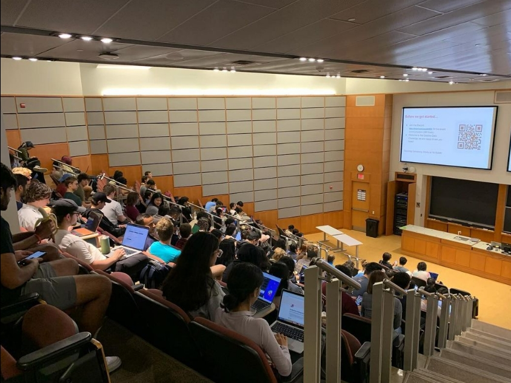

# Data Scientist

#### Technical Skills: SQL, Python, R, Tableau, AWS, Google Analytics 4

## Education			        		
- B.S., Computer Science | The University of North Carolina at Charlotte (_To Be Completed in May 2025_)

## Certifications
- Data Scientist Associate in R Certificate | DataCamp (_August 21, 2023_)
- Google Analytics 4 Certificate | Google (_July 31, 2023_)

## Work Experience
**Logistic Intern @ The Consignors (_May 2023 - August 2023_)**
- Assisted with delivery logistics and ensuring timely and accurate shipments. 
- Analyzed data and visualized responses for North Carolina auctioneer site covering bids, users, lots, auctions and related demographics.  

**Assistant Warehouse Manager @ The Downsizers (_May 2022 - August 2022_)**
- Directed and managed day-to-day warehouse operations, including efficient inventory management for a team of senior move managers. 

## Key Projects

### Improving an Online Statistics Course with Custom Metrics
> 2024 Duke DataFest
[Event Details](https://dukestatsci.github.io/datafest/))

Designed and implemented several statistical measurement indexes, such as persistence, accuracy, and efficiency, utilizing data provided by the course platform "CourseKata" along with our own variables. Applied **ANOVA** analysis with Kruskal Result in **Python's Pandas** to test the significance of these indexes and to identify influential factors. Leveraged **Tableau Dashboarding** to create visualizations of our findings, which facilitated actionable recommendations for improving the course content and structure. These recommendations included adding video questions, reorganizing question distributions, and clustering students into groups for personalized benefits.

### Evaluating NC’s Education System
> 2024 North Carolina Education Datathon
[Event Details](https://hunt-institute.org/north-carolina-education-datathon/)

Worked with a multidisciplinary team of statisticians to analyze public datasets related to North Carolina’s education system. Evaluated the strengths and weaknesses of the existing system, pinpointing areas for improvement. Developed a novel mathematical index incorporating weighted values to measure the health and future prospects of education systems across NC counties. Personally translated and presented complex data insights through user-friendly visualizations, making the findings accessible and actionable for stakeholders.

https://github.com/CamH53/camhportfolio.github.io/assets/131498291/dd5298a7-5a8d-483a-b896-a62e455a27a8

### Hospital Readmittance Predictive Model
> 2023 Carolina Data Challenge
[Event Details](https://cdc.cs.unc.edu/)

Conducted thorough research and data cleaning on intricate healthcare datasets in collaboration with a partner (@htnasah). Led a data science project focused on enhancing diabetes patient care, which secured 1st place out of 8 competing teams. This involved comprehensive data analysis and visualization in Python, leading to innovative solutions for improving patient care. The project showcased strong problem-solving abilities and adherence to a strict software development lifecycle.

[Github Repository](https://github.com/CamH53/DiabetesDatasetTool)

[LinkedIn Story](https://www.linkedin.com/pulse/unlocking-insights-from-nostalgia-my-experience-2023-carolina-hirsh/?trackingId=%2BRcOr81jQ12IJQoZVbMqsg%3D%3D)

## Talks & Presentations
- Your Data Has or Will be leaked - ATKNS 102, Spring 2024
- Project Presentation: Creating Tools to Help Students Graduate on Time - 2024 UNC Charlotte Hackathon, Spring 2024
- Project Presentation: Improving an Online Statistics Course with Custom Metrics - 2024 Duke Datafest, Spring 2024
- Project Presentation: Evaluating NC’s Education System - 2024 NC State Datathon, Fall 2024
- Project Presentation: Hospital Readmittance Predictive Model - 2023 Carolina Data Challenge, Spring 2023
- How Research in Behavioral Coaching Affects Client Success - Toastmasters Seminar, Fall 2023

## Awards			        		
- Eagle Scout | Scouts of America (_June 2020_)

[Data Science Blog](https://medium.com/@cameronhirsh)
